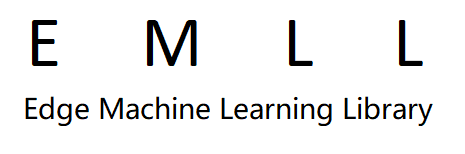
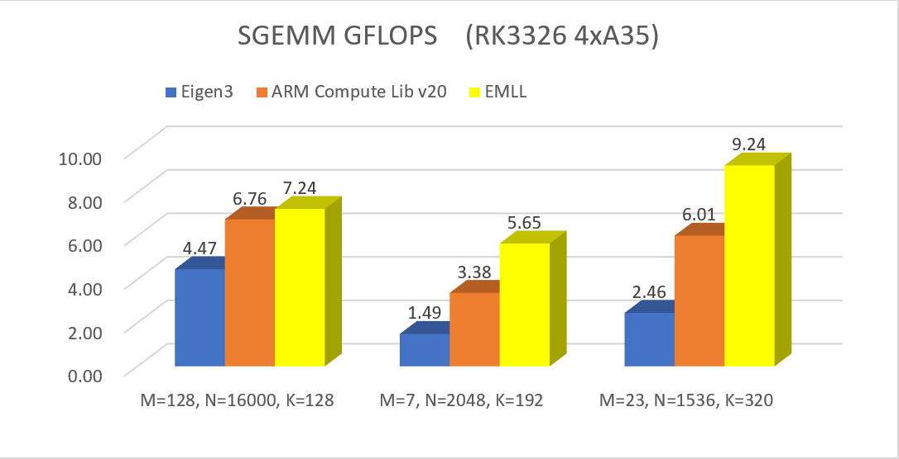
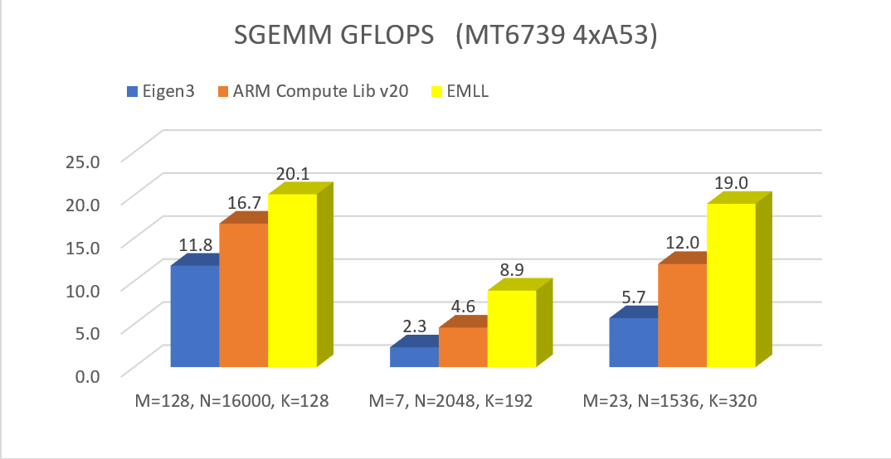

[中文介绍](ReadMe_ZH.md)

# Edge ML Library - High-performance Compute Library for On-device Machine Learning Inference

Edge ML Library (EMLL) offers optimized basic routines like general matrix multiplications (GEMM) and quantizations, to speed up machine learning (ML) inference on ARM-based devices. EMLL supports fp32, fp16 and int8 data types. EMLL accelerates on-device NMT, ASR and OCR engines of Youdao, Inc.

## Features

### Performance-Oriented Design

The matrix-multiplication routines are heavily-optimized for matrix shapes common in on-device ML tasks, including "skinny" ones. The matrix-multiplication kernels are tuned for specific CPUs with a large portion of inline assembly codes.

Here are benchmarks of SGEMM on 2 machines[1]:

| armv8a cortex-A35 4-thread | armv8a cortex-A53 4-thread |
| -------------------------- | -------------------------- |
|  |  |

[1].The fomular of GEMM: C[MxN] = A[MxK] B[KxN]; For each test case, the better performance in all-row-major and all-column-major situations is selected.

### Facile Interface

The data and parameters are passed straightforward without wrappings. Matrices and arrays are passed with base address + dimensions. GEMM parameters seldom used in on-device inference like LDA-LDC are excluded from the interface. There is no dependency on any third-party compute libraries.

### Extensibility

EMLL abstracts the core structures of CPU-based high-performance matrix multiplication algorithms and also bias/quant functions to general macros (see files under include/common), which can be applied to a variety of processors. When developing for a new architecture, a lot of coding works can be saved with these macros.

## EMLL APIs

EMLL provides a series of C functions. See [Usage_EN.md](doc/Usage_EN.md) for details.

| Type | Name | Parameters |
| ---- | ---- | ---------- |
| Matrix Multiplication | data_type + "gemm" | matrix_orders, addresses of matrices, M, N, K, beta, number of threads |
| Fully-connect Layer (fp32) | "fc" | addresses of src/weight/bias/output, dimensions M/K/N, orders of source matrices, (number of threads) |
| Quantization | "quantize_" + "symmetric"/"asymmetric" + input_type + output_type | input array, output array, (zero point), scale, size of array, input range |
| Requantization | "requantize_" + "symmetric/asymmetric" + "_XtoY" | input array, output array, (zero point), output scale, size of array, input range |
| Bias | "bias" + data_type | the matrix to be biased, scalar bias to all elements, vector bias along major direction, vector bias along minor direction, dimensions of the matrix |

## Supported Architectures and Data Types

| Target CPU     | Matrix Multiplication                            | Bias              | Quantization             | Requantization                              |
| -------------- | ------------------------------------------------ | ----------------- | ------------------------ | ------------------------------------------- |
| ARMv7a 32-bit  | fp32 -> fp32, (u)int8 -> (u)int32                | fp32, int32       | fp32 -> (u)int8/(u)int16 | int32 -> (u)int8/(u)int16, int16 -> (u)int8 |
| ARMv8a 64-bit  | fp32 -> fp32, (u)int8 -> (u)int32, fp16 -> fp16  | fp32, fp16, int32 | fp32 -> (u)int8/(u)int16 | int32 -> (u)int8/(u)int16, int16 -> (u)int8 |

Supported OS: Linux & Android

Supported Compilers: GCC & Clang

## Future Plan

EMLL may support on-device GPUs and NPUs in the future, with the expansion of available functions, according to business requirements.

## License

Apache 2.0

## Reference

Eigen: [https://eigen.tuxfamily.org]

OpenBLAS: [https://github.com/xianyi/OpenBLAS]

