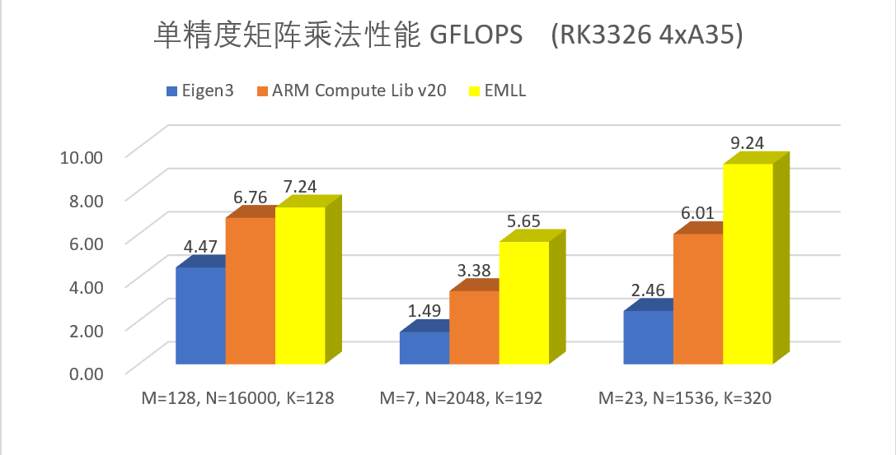
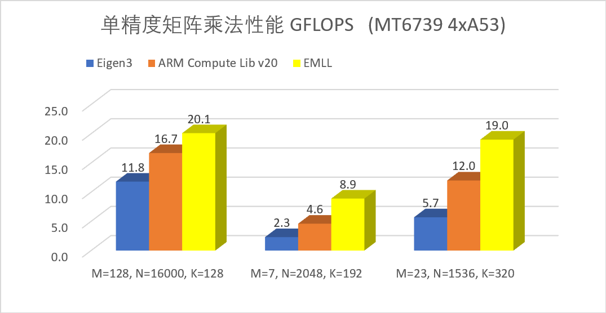

# EMLL - 高性能端侧机器学习计算库

EMLL(Edge ML Library)为加速终端侧设备上机器学习的推理而设计，提供基于端侧处理器的高性能机器学习计算函数库。EMLL支持fp32、fp16、int8等数据类型，已在有道词典笔、翻译王和超级词典等硬件产品的机器翻译和语音识别引擎中应用，大幅降低了推理延迟。

## 特点

### 高性能

EMLL实现的矩阵乘法函数，为端侧人工智能中常见的扁平矩阵作了专门的优化，为各常见ARM处理器作了特定的优化。对于cortex-A35/A53/A55处理器，本库针对它们的流水线特点，使用了汇编级别的优化。

下面是单精度矩阵乘法的测试结果[1]：

| ARMv8A Cortex-A35 四线程 | ARMv8A Cortex-A53 四线程 |
| ------------------------ | ------------------------ |
|  |  |

[1]矩阵乘法的通式为 C[MxN] = A[MxK] B[KxN]；所列数据为全行主序和全列主序的最好性能。

### 易用性

EMLL使用的函数接口在参数设计上力求简洁直接，矩阵乘法去掉了不常用的LD*参数，矩阵和向量的传递通过指针和整数维度分别传递。本库的构建和运行不依赖第三方计算库。

### 扩展性

对于矩阵乘法和量化函数，EMLL 库提取了它们和架构无关的代码作为通用的宏，这些宏可以在支持新的CPU架构时大大节省所需的代码量。

## EMLL 应用接口

EMLL提供基于 C 的接口，详情请见 [Usage_ZH.md](doc/Usage_ZH.md)。

| 函数类型 | 函数名称 | 函数参数 |
| -------- | -------- | -------- |
| 矩阵乘法 | data_type + "gemm" | 源矩阵排列顺序，各矩阵地址，M，N，K，beta，并行线程数 |
| 全连接层(单精度) | "fc" | src/weight/bias/output的地址，M，K，N，源矩阵排列顺序，(并行线程数) |
| 量化 | "quantize_" + "symmetric"/"asymmetric" + input_type + output_type | 输入数组，输出数组，(输出零点值)，缩放值，数组大小，输入范围 |
| 重量化 | "requantize_" + "symmetric/asymmetric" + "_XtoY" | 输入数组，输出数组，(输出零点值)，输出缩放值，数组大小，输入范围 |
| 偏置 | "bias" + data_type | 被偏置的矩阵，标量偏置，平行于主方向的向量偏置，平行于次方向的向量偏置，矩阵大小 |

## 各函数支持的数据类型

| 处理器         | 矩阵乘法                 | 偏置             | 量化            | 重量化        |
| -------------- | ------------------------ | ---------------- | --------------- | ------------- |
| ARMv7a 32-bit  | fp32，(u)int8        | fp32，int32 | fp32 -> (u)int16/(u)int8 | int32 -> (u)int16/(u)int8，int16 -> (u)int8 |
| ARMv8a 64-bit  | fp32，fp16，(u)int8  | fp32，int32 | fp32 -> (u)int16/(u)int8 | int32 -> (u)int16/(u)int8，int16 -> (u)int8 |

EMLL 支持在 Linux 和安卓系统上运行。

EMLL 支持用 GCC 和 Clang 编译。

## 展望

EMLL 将来会根据需求，增加对端侧 GPU 和 NPU 的支持，并拓展支持的算子范围（卷积、激活函数等）。

## 许可证

Apache 2.0

## 参考

Eigen: https://eigen.tuxfamily.org/

OpenBLAS: https://github.com/xianyi/OpenBLAS/

